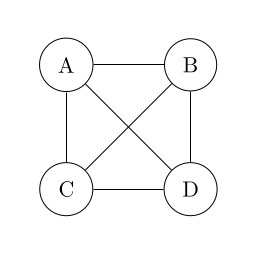
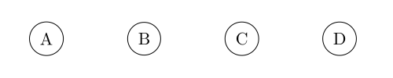
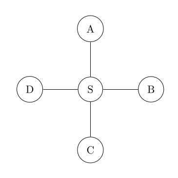

# Grapl

This is an implementation of an idea I had for a better graph notation back in
2019. The original idea was outlined [here][blog-1], however this crate aims to
extend this basic idea with some extensions for making graphs with ad-hoc edges
and set-like operations. Stay tuned!

## Syntax

### Fully Connected Graph

```
{A, B, C, D}
```


### Fully Disconnected Graph

```
[A, B, C, D]
```


### Distributivity

```
{S, [A, B, C, D]}
=> normalize
[{S, A}, {S, B}, {S, C}, {S, D}]
```


### Resolution
[WIP #1](https://github.com/nixpulvis/grapl/pull/1)

```
G1 = [A, B]
G2 = {X, G1}
=> resolve => normalize
G1 = [A, B]
G2 = [{X, A}, {X, B}]
```


[blog-1]: https://nixpulvis.com/ramblings/2025-08-15-graph-notation
